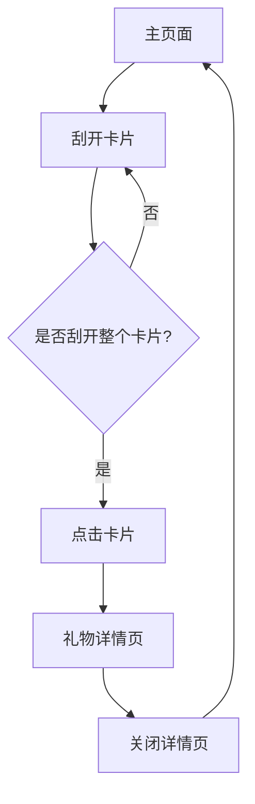

# 生日惊喜网页产品需求文档

## 1. 产品概览

生日惊喜网页是一个专为生日庆祝设计的互动式网页应用，通过刮刮乐效果为用户带来惊喜体验。用户需要刮开卡片才能查看礼物详情，营造神秘感和期待感。

## 2. 核心功能

### 2.1 用户角色

| 角色 | 注册方式 | 核心权限               |
| -- | ---- | ------------------ |
| 访客 | 无需注册 | 浏览礼物卡片、刮开卡片、查看礼物详情 |

### 2.2 功能模块

我们的生日惊喜网页包含以下主要页面：

1. **主页面**：展示礼物卡片网格，包含刮刮乐效果
2. **礼物详情页**：展示礼物的详细信息和图片

### 2.3 页面详情

| 页面名称  | 模块名称   | 功能描述                               |
| ----- | ------ | ---------------------------------- |
| 主页面   | 卡片网格   | 以网格形式展示多个礼物卡片，每个卡片初始状态被刮刮乐覆盖       |
| 主页面   | 刮刮乐功能  | 用户通过鼠标或触摸滑动刮开卡片表面，必须刮开整个卡片才能点击进入详情 |
| 主页面   | 卡片点击   | 刮开整个卡片后，点击卡片进入礼物详情页                |
| 礼物详情页 | 礼物信息展示 | 展示礼物的标题、图片和详细描述                    |
| 礼物详情页 | 关闭功能   | 点击关闭按钮或模态框外部关闭详情页                  |

## 3. Core Process

用户操作流程：

1. 用户访问生日惊喜网页
2. 看到多个被刮刮乐覆盖的礼物卡片
3. 用户开始刮开卡片表面（需要刮开整个卡片）
4. 刮开整个卡片后，卡片变为可点击状态
5. 用户点击卡片进入礼物详情页
6. 用户查看礼物详情后，点击关闭按钮返回主页面
7. 用户可以继续刮开其他卡片

## 4. 用户接口设计

### 4.1 设计风格

- **主色调**：粉色系渐变背景，营造浪漫温馨的氛围
- **辅助色**：紫色和白色，增强视觉层次感
- **按钮风格**：圆角设计，柔和的阴影效果
- **字体**：Arial 无衬线字体，清晰易读
- **布局风格**：卡片式网格布局，响应式设计
- **图标风格**：使用emoji作为礼物图标，增加趣味性

### 4.2 页面设计概览

| 页面名称  | 模块名称  | UI元素                               |
| ----- | ----- | ---------------------------------- |
| 主页面   | 卡片网格  | 2x3网格布局，每个卡片有粉色系背景，白色卡片内容，卡片间有适当间距 |
| 主页面   | 刮刮乐效果 | 卡片初始被重复线性渐变的刮刮乐层覆盖，刮开后显示卡片内容       |
| 主页面   | 标题区域  | 顶部显示"生日快乐，我的宝贝"标题，下方显示副标题          |
| 礼物详情页 | 内容区域  | 白色背景的模态框，包含礼物标题、图片和描述              |
| 礼物详情页 | 关闭按钮  | 右上角的"×"按钮，用于关闭详情页                  |

### 4.3 自适应

- **设计理念**：移动优先，针对iPhone 17屏幕尺寸优化
- **响应式布局**：在不同屏幕尺寸下自动调整卡片大小和布局
- **触摸优化**：支持触摸设备的刮刮乐操作，确保在手机上有良好的用户体验
- **性能优化**：确保刮刮乐效果在移动设备上流畅运行

## 5. 技术实现

### 5.1 技术栈

- **前端**：HTML5, CSS3, JavaScript
- **资源**：使用 picsum.photos 提供的占位图片
- **音频**：背景音乐支持

### 5.2 核心功能实现

1. **刮刮乐效果**：
   - 使用HTML5 Canvas或DOM元素实现刮开效果
   - 检测刮开区域的大小，只有当刮开面积达到卡片总面积的90%以上时，才允许点击进入详情
   - 支持鼠标和触摸事件
2. **礼物数据管理**：
   - 使用JavaScript对象存储礼物信息，包括标题、图标、图片和描述
   - 动态生成卡片和详情页内容
3. **响应式设计**：
   - 使用CSS Grid和媒体查询实现响应式布局
   - 针对不同屏幕尺寸优化UI元素大小和间距

## 6. 功能要求

### 6.1 刮刮乐功能改进

**核心要求**：刮开动作不能只刮一次，必须刮开整个卡片才能点击进入卡片详情。

**实现方案**：

1. 计算卡片的总面积
2. 跟踪用户刮开的区域大小
3. 当刮开区域达到卡片总面积的90%以上时，移除刮刮乐层
4. 只有当刮刮乐层完全移除后，卡片才变为可点击状态

### 6.2 性能要求

- 刮刮乐效果在移动设备上运行流畅，无卡顿
- 页面加载速度快，图片资源优化
- 响应式布局在不同设备上表现一致

### 6.3 用户体验要求

- 刮刮乐操作手感真实，有良好的反馈
- 卡片点击区域明确，交互反馈及时
- 详情页加载流畅，内容展示清晰
- 整体视觉效果温馨浪漫，符合生日主题

## 7. 测试计划

### 7.1 功能测试

- 验证刮刮乐功能是否正常工作
- 确认必须刮开整个卡片才能点击进入详情
- 测试详情页的展示和关闭功能
- 验证响应式布局在不同设备上的表现

### 7.2 性能测试

- 测试页面加载速度
- 验证刮刮乐效果在移动设备上的流畅度
- 测试页面在不同网络环境下的表现

### 7.3 兼容性测试

- 测试在主流浏览器中的表现
- 验证在不同移动设备上的兼容性
- 测试触摸操作的响应性

## 8. 项目计划

### 8.1 开发阶段

1. **准备阶段**：分析需求，确定技术方案
2. **开发阶段**：实现核心功能，包括刮刮乐效果、卡片布局和详情页
3. **测试阶段**：进行功能测试和性能测试
4. **优化阶段**：根据测试结果进行优化
5. **部署阶段**：部署到服务器，确保可访问性

### 8.2 关键里程碑

- 完成刮刮乐核心功能实现
- 实现完整的卡片和详情页交互
- 完成响应式布局适配
- 通过所有功能测试
- 项目最终交付

## 9. 风险评估

### 9.1 技术风险

- **刮刮乐效果性能**：在移动设备上可能存在性能问题，需要优化
- **兼容性问题**：不同浏览器对触摸事件的支持可能不同
- **图片加载0**：图片资源可能影响页面加载速度

### 9.2 解决方案

- 使用轻量级的刮刮乐实现方案，避免使用Canvas等重资源
- 针对不同浏览器进行兼容性测试和适配
- 优化图片资源，使用适当的图片格式和尺寸

## 10. 结论

生日惊喜网页是一个创意十足的生日礼物展示平台，通过刮刮乐效果增加了互动性和趣味性。核心要求是确保用户必须刮开整个卡片才能查看礼物详情，这将增强用户体验的沉浸感和期待感。

通过精心的设计和技术实现，这个项目将为生日庆祝增添一份特别的惊喜，让收礼者感受到送礼者的用心和爱意。
